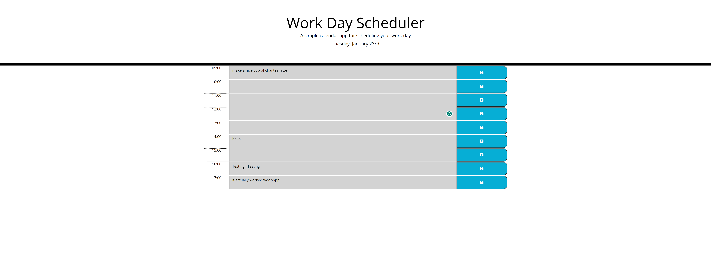

# Work-Day-Scheduler

## Purpose

To create a simple calendar application that allows a user to save events for each hour of the day by modifying starter code. This app will run in the browser and feature dynamically updated HTML and CSS powered by jQuery

## Project Goals

The primary goal for this project is to create an application (planner) that an employee with a busy schedule can use to better plan their day using a daily planner. This will allow employee to add important events to allow efficient way of managing time

### Acceptance Criteria

The app should:

- Display the current day at the top of the calender when a user opens the planner.

- Present timeblocks for standard business hours when the user scrolls down.

- Color-code each timeblock based on past, present, and future when the timeblock is viewed.

- Allow a user to enter an event when they click a timeblock

- Save the event in local storage when the save button is clicked in that timeblock.

- Persist events between refreshes of a page

## Getting started

### Prerequisites

Before starting this project, I made sure I familiarized myself with the acceptance criteria and understood the requirements

## Usage

This webpage can be accessed by [**clicking here**](https://dalabi91.github.io/Password-Generator/)

To use the application, click the link above

### Screenshot of Work-Day-Scheduler

## Resource

- [**W3 School**](https://www.w3schools.com/)
- [**MDN Web Docs**](https://developer.mozilla.org/)
- [**Day.js**](https://day.js.org/docs/en/display/format)
- [**Xpert Learning Assistant**](https://bootcampspot.instructure.com/courses/5693/external_tools/313)
- [**jQuery CheatSheet**](https://htmlcheatsheet.com/jquery/)

## License

This project is licensed under the MIT License.

## Badges

